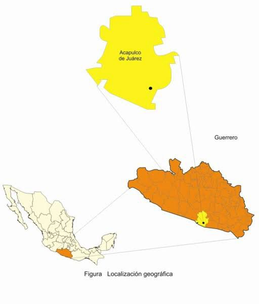
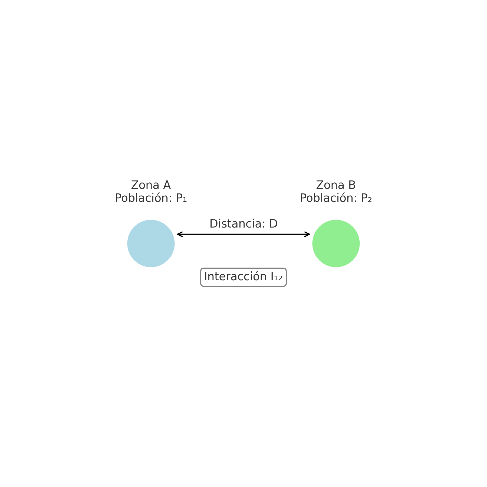
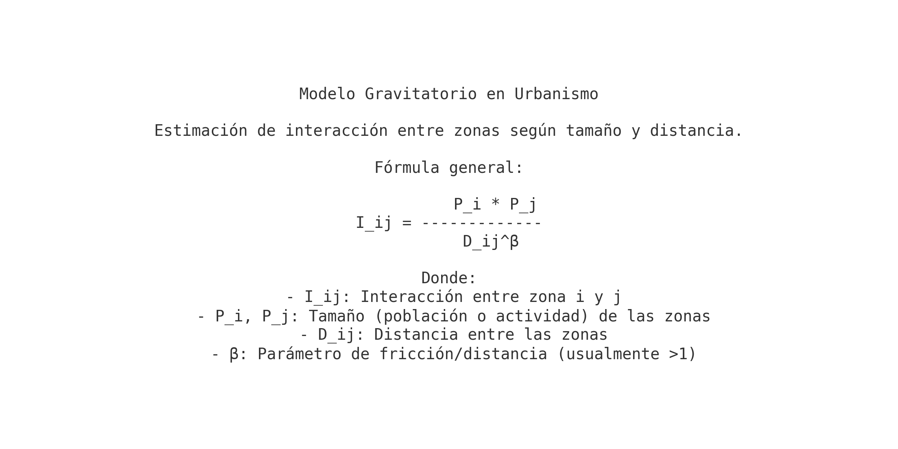
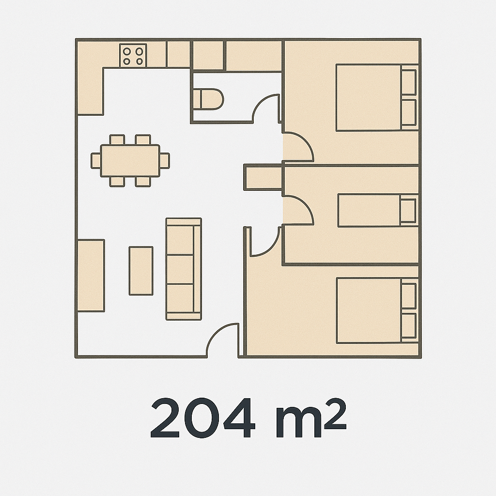
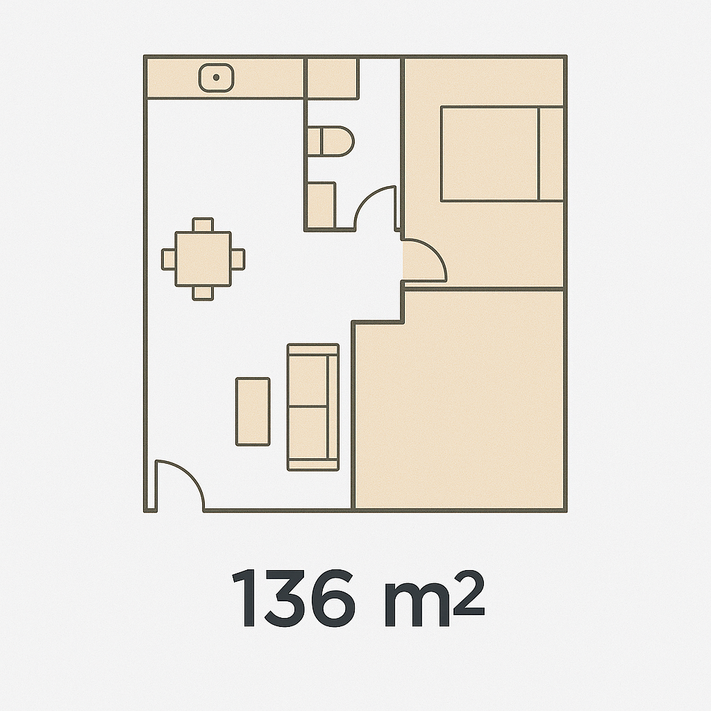
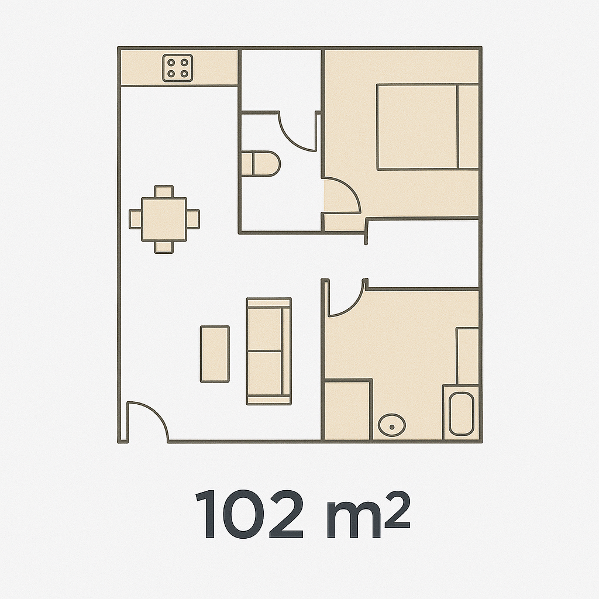
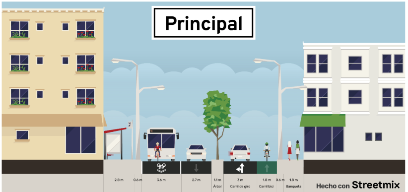
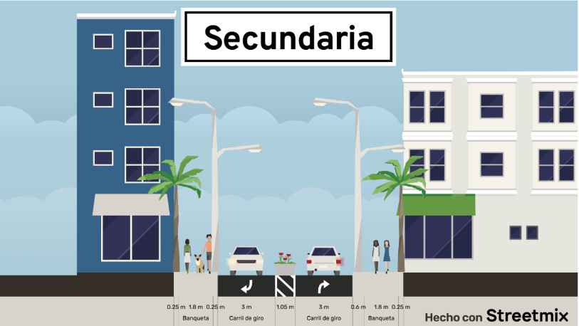
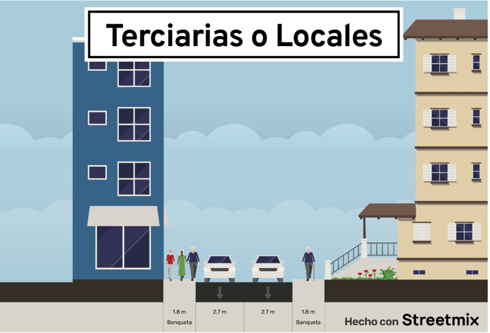

# Proyecto de Investigación "Análisis de Acapulco"

Repositorio creado para las materias de ***Seminario de Área Planeación Urbana*** y ***Taller de Investigación Barrio y Ciudad***, donde se hace un análisis sobre la habitabilidad de la región Sur-Oriente del Municipio de Acapulco de Juárez, ubicado en el estado de Guerrero dentro de la república Mexicana.

****
## Integrantes del Proyecto

* Bolaño Espejo Mitzy Alejandra: mitzyboes@gmail.com
* Cabrera Garibaldi Hernán Galileo: galigaribaldi0@gmail.com
* Castro Huerta Rubén
* Nativitas Vázquez Gabriela: gabrielanativitasv@gmail.com
****
## Alcances de la investigación

El repositorio contiene material que es necesario para las dos materias anteriormente mencionadas. Aunque estas se parezcan en su versatibilidad y concordancia, las mismas tienen alcances diferentes:
1. Seminario de Àrea, Planeación Urbana: Alcance Regional, de 50 a 300 km de radio
2. Talles de investigación Barrio y Ciudad: Alcance Local o Municipal, menos de 50 km. **Con mayor énfasis en la creación de viviendas y su diseño Urbanístico**.
****
## Entregas Resultantes
A continuación se describen los diferentes entregas junto con su objetivo y su alcance, así como las características de cada uno.

### Seminario de Investigacición
Durante el semestre se hizo un análisis comparativo y planeativo de la localidad seleccionada (Acapulco de Juárez), donde se revisaron sus características físicas, geológicas y socio-económicas. Dando como resultado el modelo gravitatorio planteado en clase.

#### Entrega 1: Medio Físico Natural

Primera entrega donde se hace una descripción de los siguientes puntos:
* Localización Física
* Climas
* Geología
* Edafología
* Pendientes
* Hidrografía
* Uso de Suelo y Vegetación
**Conclusión:** Con base en los mapas anteriores se puede hacer un análisis de las características geográficas del terreno (geológicas, hidrológicas, edafológicas). Marcando una notoria división entre la zona Norte/Oriente (mayormente accidentada por la sierra y ser un clima más cálido) y la zona Sur/Poniente (igualmente accidentada pero con zonas más planas y un clima cálido-sub húmedo por su cercanía a la costa), siendo que esta última presenta propiedades más adecuadas para poder urbanizar. Razón por la cual, es la mostrada en el mapa. Otro argumento a destacar, es la comunicación vial que existe en la zona. La carretera principal tiene límite en la zona norte/poniente y atraviesa la mitad de la sierra, facilitando nuestra delimitación.

#### Entrega 2: AGEBS por condición Social
Segunda entrega la cual tuvo como objetivo medir por AGEB los porcentajes más representativos de cada sector poblacional. Las áreas que se tomaron para este estudio se describen a continuación con su respectiva interpretación:
1. **Población Total**: La población se encuentra uniformemente distribuida a lo largo de la ciudad, teniendo sólo algunas AGEB donde la población destaca por su alta densidad
   1. **Estructura de Edades**:  Los rangos de edades más predominantes en la ciudad de Acapulco van de los 0 a los 44 años, posterior a este rango, la cantidad de habitantes va descendiendo significativamente. El rango de edades donde existe mayor número de población es el de 10–14 y 15–19, teniendo, en conjunto, una población de 134,086 habitantes. El rango de edades donde existe el menor número de población es el de 85 y más, con una población de 6,237 habitantes. *Se sugiere revisar gráficas en el siguiente enlace:* [LINK DE SEGUNDA ENTREGA](https://github.com/galigaribaldi/SeminarioInvestigacion/blob/main/ASSETS/PDF/SEMINARIO/Segunda%20Entrega/ENTREGA%202.pdf)
   2. **Tasa de Crecimiento Anual**: A pesar de que en los últimos años no se encuentra información clara sobre la Tasa de Crecimiento Media Anual (TCMA) de la entidad de Acapulco de Juárez, se evidencia que a lo largo de los años se han tenido variaciones que pueden afectar a los diferentes sectores sociales, económicos y ambientales, ya que no hay presencia de un equilibrio. *Se sugiere revisar gráficas en el siguiente enlace:* [LINK DE SEGUNDA ENTREGA](https://github.com/galigaribaldi/SeminarioInvestigacion/blob/main/ASSETS/PDF/SEMINARIO/Segunda%20Entrega/ENTREGA%202.pdf)
2. **Población Económicamente Activa**: Dentro de la ciudad, la PEA se encuentra, en su mayoría, distribuida de forma uniforme, evidenciando zonas con mayor concentración de PEA en las cercanías a las Playas, sobre todo en la zona de la Playa Caleta, La Quebrada y la zona hotelera. Las zonas donde la PEA no es tan sobresaliente corresponden directamente con las áreas donde la densidad de población es baja. *Se sugiere revisar el mapa generado en la sección de entregables*
3. **Población Ocupada**: Dentro de la ciudad, la población ocupada se encuentra, en su mayoría, distribuida de forma uniforme, evidenciando zonas con mayor concentración de población ocupada en las cercanías a las Playas, sobre todo en la zona de la Playa Caleta, La Quebrada y la zona hotelera. Las zonas donde la población ocupada no es tan sobresaliente corresponden directamente con las áreas donde la densidad de población es baja, al igual que la PEA. *Se sugiere revisar el mapa generado en la sección de entregables*: [LINK DE SEGUNDA ENTREGA](https://github.com/galigaribaldi/SeminarioInvestigacion/blob/main/ASSETS/PDF/SEMINARIO/Segunda%20Entrega/ENTREGA%202.pdf)
4. **Población Desocupada**: La ciudad de Acapulco de Juárez cuenta con un número muy bajo de población desocupada, la cual se concentra en la zona cercana a La Quebrada. Todas las demás AGEB presentan concentraciones en menor medida, sobresaliendo los rangos de 17–34 hab. y 34–50 hab. *Se sugiere revisar el mapa generado en la sección de entregables*: [LINK DE SEGUNDA ENTREGA](https://github.com/galigaribaldi/SeminarioInvestigacion/blob/main/ASSETS/PDF/SEMINARIO/Segunda%20Entrega/ENTREGA%202.pdf)
5. **Distribución de la Población Ocupada por actividad  Económica y su nivel de Ingresos**: En el censo de 2018, destaca, por personal ocupado, el comercio al por menor, con 39,765 personas. A continuación, se posiciona el sector de servicios de alojamiento temporal y de preparación de alimentos, con 31,591 personas, lo cual representa a la industria hotelera de la zona. En tercer lugar se encuentra el sector de otros servicios excepto actividades gubernamentales, con una disminución de más de 20 mil personas en comparación con los sectores previamente mencionados, teniendo un total de 9,528 personas ocupadas. Por otra parte, por remuneración media, destaca en primer lugar el comercio al por mayor, con un promedio de 161,941 79 anual y de 572.08 diario, en segundo lugar entra el sector de transportes, correos y almacenamiento, con un promedio de 143,548.36 anual y de 470.11 diario. Finalmente, en tercer lugar está el sector de información en medios masivos, con un promedio de 133,917.49$ anuales y de 445.65 diarios. *Se sugiere revisar gráficas y tablas generadas en la sección de entregables* 
[LINK DE SEGUNDA ENTREGA](https://github.com/galigaribaldi/SeminarioInvestigacion/blob/main/ASSETS/PDF/SEMINARIO/Segunda%20Entrega/ENTREGA%202.pdf)
1. **Población Alfabeta de 15 años y más**: Se evidencia que la mayor parte del municipio presenta niveles de alfabetismo, únicamente en la zona periférica hacia la Laguna de Tres Palos se presenta menor nivel de este aspecto sociocultural.
2. **Población Analfabeta de 15 alos y más**: Se evidencia que la mayor parte del municipio presenta niveles bajos de analfabetismo, únicamente en la zona periférica hacia la Laguna de Tres Palos y algunas zonas del norte y oeste se presentan niveles medio de analfabetismo.
3. **Población de 15 años con educación básica incompleta**: Se evidencia que la mayor parte del municipio presenta niveles bajos de educación básica incompleta, únicamente en ciertas zonas pequeñas, como en el Lago de Tres Palos resalta este aspecto sociocultural.
4. **Población de 15 años con educación básica incompleta**: De los datos mostrados, se puede observar que la moría de la población en el municipio de Acapulco, tiene la educación básica completa, siendo que la zona cercana a la Laguna de 3 Palos es la más rezagada a nivel educativo.
5.  **Población de 15 años y más con educación PosBásica Completa**: De los datos mostrados, se puede interpretar que la población mayor a 15 años se encuentra dividida en dos secciones muy marcadas: al norte hay mayor rezago educativo, siendo que la costa se encuentra en su mayoría con educación posbásica completa. 
6.  **Población de 18 años con al menos un grado aprobado en educación Media Superior**: De los datos mostrados, se puede interpretar que la población mayor a 18 años presenta un rezago educativo, ya que la cantidad de personas que sobrepasan este grado académico disminuye en el municipio, en zonas muy marcadas.
7.  **Población de 25 años y más con al menos un grado aprobado en educación Media Superior**: De los datos mostrados, se puede interpretar que la población cercana a la costa y poniente posee un grado educativo mayor a media superior, al igual que la población cercana a la Laguna de Tres Palos. Sin embargo, la gente cercana a las zonas del norte y zonas accidentadas tiene un mayor rezago educativo.
8.  **Marginación y Rezago Social**: En promedio, el GRS de la ciudad de Acapulco de Juárez es alto, medio y bajo. Hay muy pocas AGEBs donde el grado de rezago social es muy alto, al igual que las que tienen grado de rezago social muy bajo.
9.  **Población Nacida en la Entidad**: Es evidente la predominancia de las AGEBs donde los habitantes son nacidos y originarios de la ciudad de Acapulco de Juárez. Las zonas donde disminuyen los habitantes nacidos en la entidad son las más cercanas a la península, donde se ubica el resort Las Playas, la Bahía de Santa Lucía y la zona de Puerto Marqués.
10. **Población Nacida en otra Entidad**: Las AGEBs donde se concentra la población nacida en otra entidad resaltan al estar rodeadas de otras áreas donde la mayoría de los habitantes son originarios de la ciudad de Acapulco de Juárez. Estas zonas donde existe mayor número de personas nacidas en otras entidades se ubican en Pie de la Cuesta, en las cercanías de la Bahía de Santa Lucía y de Puerto Marqués.
11. **Población Nacida en Otro País**: A lo largo de la entidad predominan las AGEBs donde la población es nacida en la República Mexicana; sin embargo, resaltan algunas AGEBs en las que algunos habitantes son nacidos en otro país. Estas áreas se ubican, sobre todo, en la península, en las cercanías de la Bahía de Santa Lucía y en Puerto Marqués. Aunque estas áreas sobresalen, la realidad es que la población nacida en otro país es muy poca en esta entidad, teniendo un máximo de 4 unidades en la AGEB con mayoría de personas con esta característica.
12. **Etnicidad, población nacida en hogares censales indígenas:** Se evidencia que la mayor parte del municipio no presenta población indígena. Son pequeñas zonas hacia la sierra sur y el norte las que presentan niveles bajos, y únicamente una zona céntrica en la sierra presenta población entre 548 y 730 personas de etnicidad indígena.
13. **Usos y Costumbres**
    1.  Festival "La Nao China": Es una celebración cultural que rinde homenaje a la historia del puerto de Acapulco y a la relación entre América y Asia. Tiene más de una década siendo celebrado en la Av. Costera Miguel Alemán.
    2.  Fiesta de la Virgen de Guadalupe: Contingentes de familias acompañados de fuegos artificiales, música y niños caracterizados de indígenas participan en una procesión desde sus centros de trabajo o colonias hasta llegar a la iglesia o catedral de su adscripción. Las procesiones concluyen el 11 de diciembre y la noche de ese mismo día se vela la imagen de la virgen para concluir el 12 de diciembre con la misa en la catedral. Algunos de los puntos donde se celebra esta fiesta son la Catedral de Acapulco, la Playa El Morro, la Bahía de Santa Lucía e incluso la Isla La Roqueta.
    3.  Fiesta de San Isidro Labrador: San Isidro Labrador es el santo más venerado en Acapulco, se le festeja mediante una fiesta el 15 de mayo. Los festejos duran siete días y consisten en la realización de una feria, juegos pirotécnicos y música. Se celebra a lo largo de toda la localidad.
    4.  Fiesta del Corazón de Jesús: Esta fiesta se lleva a cabo el 14 de abril con procesiones donde llevan consigo al Santísimo para que dé su bendición al mar y no suceda nada malo. Se celebra en la Parroquia del Sagrado Corazón de Jesús, ubicada en la colonia Plan de los Amates.
    5.  Martes de Carnaval: Se celebra 40 días antes de Semana Santa y se realizan bailes de máscaras, batallas de flores, desfiles, fuegos artificiales y la participación de grupos culturales nacionales e internacionales. Algunos de los puntos donde se festeja son el Parque de la Reina, la Plaza Álvarez y la Glorieta de la Diana Cazadora.
    6.  Desfile de Globos Gigantes: Incluye globos gigantes, carros alegóricos, tablas rítmicas, payasos, música y regalos para niños. Recorre 3.7 km y se realiza sobre la avenida costera Miguel Alemán, frente al Parque Papagayo
    7.  La Quebrada: La tradición de los clavadistas de La Quebrada es un espectáculo emblemático de la ciudad. Los clavadistas se lanzan desde acantilados de más de 35 metros de altura; en los últimos horarios del espectáculo, los clavadistas se lanzan iluminados por antorchas. Se ubican en los acantilados de La Quebrada.

#### Entrega 3: Infraestructura y Transporte
Para esta entrega se hace un análisis descriptivo sobre la infraestructura y servicios que posee el municipio de Acapulco. A continuación se presentan las secciones con su respectiva interpretación:
1. **Red Hidráulica**: En el sitio de estudio existen dos unidades de captación; en el Río Papagayo, la cual cuenta con 4 obras de toma para captación, y en el Río Atoyac y otros, la cual cuenta con 10 obras de toma para captación. El abastecimiento en cuanto a la red hidráulica en la zona es más eficiente, contando con gran cantidad de pozos y tanques de agua a lo largo de la zona, permitiendo que hasta las localidades más alejadas del centro tengan la posibilidad de abastecerse de agua. Sin embargo, las plantas potabilizadoras son escasas, contando sólo con 2 en la zona.
2. **Red Sanitaria**: Este servicio está a cargo de la Comisión de Agua Potable y Alcantarillado del Municipio de Acapulco (CAPAMA). INEGI menciona, con respecto a la disponibilidad de servicios de agua potable en el área urbana, que 91.4 % de la población tiene acceso a agua entubada y el 94.5 % a drenaje con servicios sanitarios. La cobertura actual del servicio de alcantarillado es de 72 %, y se encuentra por debajo de la media nacional de 93.20 % y del porcentaje estatal, reportado en 83.30 %.
3. **Red Eléctica**: Se ecvidencia que la red eléctrica si da abastecimiento a toda la región.
4. **Red de Vailidades**: La red vial de Acapulco está mayormente sustentada en carreteras federales, siendo las de mayor importancia la de Chilpancingo que pasa por Iguala. Al norte-poniente está la carretera federal a Coyuca de Benítez y al oeste la que va para Ixtapa Zihuatanejo. Sin embargo, la de mayor afluencia es la que parte de Acapulco a Chilpancingo, siendo que esta reporta un promedio de 30 viajes diarios en transporte público (autobuses), con una alta frecuencia y afluencia, que a su vez pasa por el municipio de Iguala. Todo esto entre semana (lunes a jueves). De manera similar, para Ixtapa Zihuatanejo e Iguala (solo este municipio), los viajes en autobuses es de 13 a 15 en promedio. Siendo una cantidad importante de pasajeros. El agua recolectada por la red de drenaje principal se envía por emisión de gravedad y es dirigida hasta la planta de tratamiento.
   1. **Tabla correspondiente a las Horas y rutas de servicios de transporte público**: 
      1. El municipio en donde se registran más viajes entre semana con destino a Acapulco es Chilpancingo, contando con 180 viajes en los dos servicios de autobuses contemplados. Seguido de este, los viajes con origen en otros municipios descienden significativamente.
      2. El segundo origen más común de los habitantes que se dirigen hacia Acapulco, es Iguala, con 66 viajes a la semana.
      3. Posteriormente, Ixtapa Zihuatanejo ocupa el tercer lugar entre los municipios contemplados, con 58 viajes por semana.
      4. Coyuca de Benítez es el municipio donde hay menos traslados, al menos por transporte de autobús, contando con 26 viajes semanales.
   **En total, el número de viajes entre las dos líneas de transporte, de lunes a jueves, es de 330.**
5. **Equipamiento (TOMO I), Educación y Cultura**: Conforme al Tomo I: Educación y Cultura, se observa que los equipamientos se concentran en la ciudad, abundando en primer lugar los salones o centros de convenciones, en segundo lugar las bibliotecas y por último las escuelas en diferentes zonas de la región. A pesar de que la mayoría supera un radio de 50 km, se optó por proyectar un radio de 40 km para que se visualizara y se diera a entender que su radio de acción tiene impacto casi a nivel regional.
6. **Equipamiento (TOMO II), Salud y Asistencia Social**: Conforme al Tomo II: Salud y Asistencia, se observa que los equipamientos se concentran en la ciudad, donde se analiza que estos no se encuentran equitativamente distribuidos en la zona de estudio, a excepción del equipamiento de hospitales generales, los cuales tienen un mayor radio de influencia, mientras que los demás generan solamente un impacto a nivel municipal, ya que sus radios de acción son menores, ocasionando que el resto de la región se encuentre sin los servicios de estos equipamientos.
7. **Equipamiento (TOMO III), comercio y abasto**: Conforme al Tomo III: Comercio y Abasto, se observa que, a pesar de que los equipamientos tienen un mayor radio de influencia, estos no cubren toda la región de manera equitativa, dejando zonas sin servicios. Se destacan solamente una central de abasto al norte del municipio y un mercado central al suroeste. Por último, se hacen notorios los rastros, dos en el municipio, uno al norte y uno en Coyuca.
8. **Equipamiento (TOMO IV), comunicación y Transporte**: Conforme al Tomo IV: Comunicación y Transporte, se puede notar que la mayor parte de los servicios se encuentran cercanos a la costa, lugar donde se ha desarrollado gran parte del crecimiento poblacional y turístico. Sin embargo, conforme se va avanzando a las zonas oriente y poniente, los servicios disminuyen paulatinamente. Aun así, los radios de acción regional cubren sin problema la mayor parte del área.
9. **Equipamiento (TOMO V), recreación y Deporte**: Conforme al Tomo V: Recreación y Deporte, se puede notar que la mayor parte de los servicios se encuentran cercanos a la costa en el caso de centros deportivos. Sin embargo, la existencia de parques urbanos es prácticamente inexistente, por lo que la zona carece completamente de este servicio.
10. **Equipamiento (TOMO VI) Servicios de Gobierno**: Dentro de los servicios gubernamentales, las oficinas e inmuebles destinados para cada especialidad son fundamentales para cuidar y conservar el equilibrio ambiental, mejorando el entorno urbano y proporcionando bienestar y comodidad a la población en general. Uno de estos servicios es la recolección y disposición final de la basura; otro es la seguridad y justicia, que facilita la regulación de las relaciones entre los individuos y organizaciones sociales para que la sociedad se desarrolle en un ambiente de tranquilidad y equilibrio.

**Interpretación:** Con base en las características de infraestructura y de equipamiento de la localidad de Acapulco de Juárez, se logra definir el crecimiento de la región, alcanzando los municipios de Coyuca de Benítez, Chilpancingo, Iguala e Ixtapa Zihuatanejo. Mostrando una dependencia hacia el municipio de Acapulco, en cuestión de educación, comercio, abasto, salud, vialidades, red hidrosanitaria, etc.

#### Entrega 4 o Final: Modelo Gravitatorio y Alcances

Para esta entrega se hace uso del **Modelo Gravitatorio**. El modelo gravitatorio es una fórmula utilizada en urbanismo para estimar la interacción entre dos zonas geográficas, basándose en el tamaño (población, actividad económica) y la distancia entre ellas. La interacción es directamente proporcional al tamaño de ambas zonas e inversamente proporcional a la distancia que las separa. Su aplicación permite modelar flujos como movilidad, distribución de servicios o relaciones funcionales en sistemas urbanos y regionales.

**Modelo Esquemátco*

**Fórmula*

A continuación se presenta la Interpretación final sobre el modelo gravitacional que se obtuvo.  
Se recomienda ver el mapa en la sección de entregas: 
[LINK DE ENTREGA FINAL](https://github.com/galigaribaldi/SeminarioInvestigacion/blob/main/ASSETS/PDF/SEMINARIO/Entrega%20Final/ENTREGA%204.pdf)

****

### Taller de Investigación Barrio y Ciudad

A comparación de la sección pasada, en este taller se busca la implementación de 1000 viviendas para los 3 sectores poblacionales existentes en México: 
* Vivienda de tipo residencial: Viviendas con un tamaño más grande, aproximadamente 204 M2. Para este caso se planearon 155 viviendas
* Clase Media: Viviendas que están en medio de la zona residencial y vivienda de interés soccial con una medidad de 136 M2. Se planearon 345 viviendas 
* Vivienda de Interés social: Vivienda con el menor tamaño, teniendo 102 M2. Se planean 689 viviendas

#### Entrega 1: Bitácora de planeación
En ella se plantean los siguientes puntos:
1. Ubicación Exacta, así como la extensión del terreno
2. Diseño de las Manzanas
   1. Manzana 1: Con un área de 3,000 M2.
   2. Manzana 2: Con un área de 4,800 M2.
   3. Manzana 3: Con un área de 1900 M2-
3. Tipo de Viviendas.
   1. Residencial: 
   2. Media: 
   3. Interés Social: 
4. Diseños y tipos de calles
   1. Avenidas principales. 
   2. Avenidas Secundarias. 
   3. Avenidas Terciarias o locales. 
5. Equipamiento
   1. Educación
      1. Kinder (3,000 M2)
      2. Primaria (4,000 M2)
      3. Secundaria (9,000 M2)
   2. Salud:
      1. Consultorio (600 M2)
   3. Comercio
      1. Nueve puestos en total (900 M2)
   4. Transporte
      1. Estación/Paradero (5, 000 M2)
   5. Recreación:
      1. Parque (50,000 M2)
      2. Unidad Deportiva (28, 300 M2)

**Se recomienda checar el archivo adjunto de BITACORA**
[LINK DE BITACORA](https://github.com/galigaribaldi/SeminarioInvestigacion/blob/main/ASSETS/PDF/TALLER/Entrega%20Final/Bit%C3%A1cora%20Taller%20de%20Investigaci%C3%B3n.pdf)

#### Entrega Final: Mapa de planeación Urbanística

[LINK DE MAPA](https://github.com/galigaribaldi/SeminarioInvestigacion/blob/main/ASSETS/PDF/TALLER/Entrega%20Final/PLANO%20PROPUESTA.pdf)
****
## Software Usado
* QGIS Desktop V-3.34.4-Prizren.
* Qt V-5.15.13
* Python V-3.12.2
* AutoCAD 2025
****
## Fuentes de Información
* DENUE (Directorio Estadístico Nacional de Unidades Económicas)
* Instituto Nacional de Estadística y Geografía (INEGI). Disponible en: https://www.inegi.org.mx/app/descarga/?ti=6 INEGI (Instituto Nacional de Estadística y Geografía)
Portal oficial de datos e información estadística de México. Disponible en: https://www.inegi.org.mx
* Portal de Datos Abiertos del Gobierno de México
Gobierno de México. Disponible en: https://datos.gob.mx